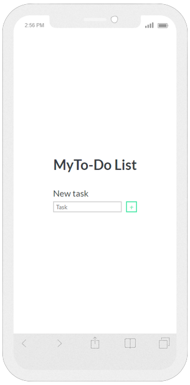
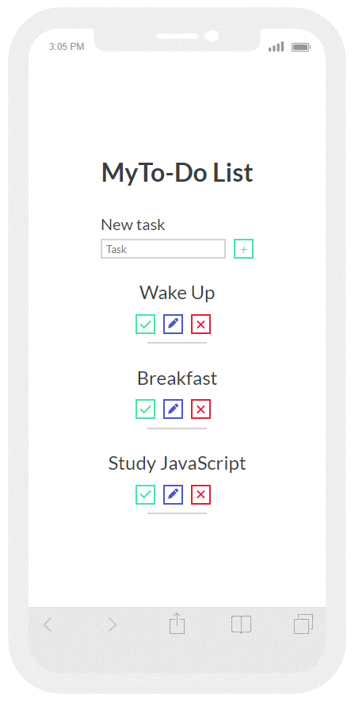
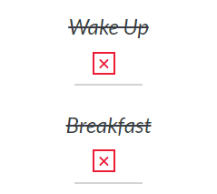
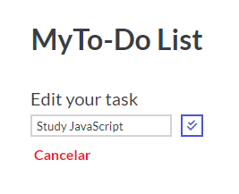
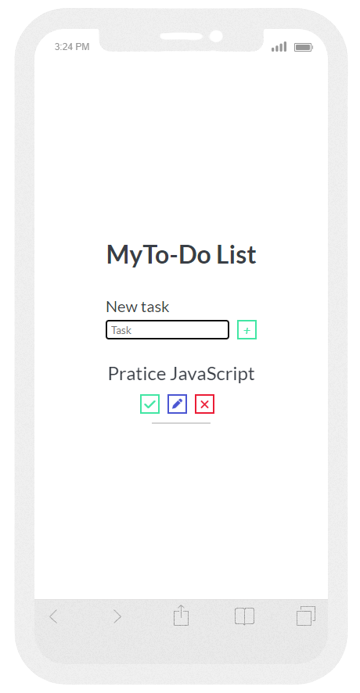

# To-Do List ✔️

 

## About 

The To-Do List project is a great form to pratice JavaScript and manipulation of elements in DOM.

## Funcionalits

- The aplication contains all basics functions of a basic todo list (Add, Complete, Edit and Remove).

### Add:

### Complete:

### Edit:

### Remove:

